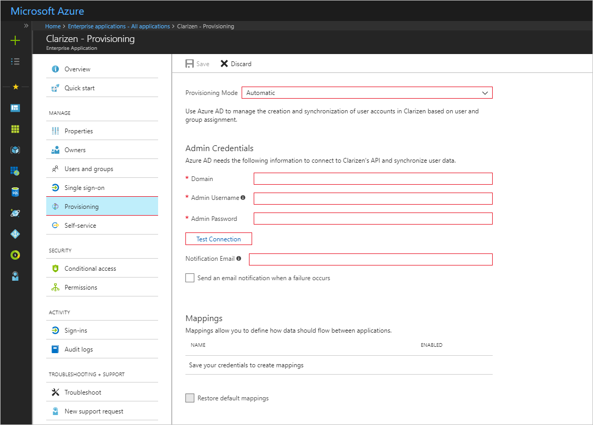

---

title: 'Tutorial: Configuring Clarizen for automatic user provisioning with Azure Active Directory | Microsoft Docs'
description: Learn how to configure Azure Active Directory to automatically provision and de-provision user accounts to Clarizen.
services: active-directory
documentationcenter: ''
author: asmalser-msft
writer: asmalser-msft
manager: sakula

ms.assetid: aa5f8b72-b80c-40c0-8fb3-a2ba56fea52b
ms.service: active-directory
ms.workload: identity
ms.tgt_pltfrm: na
ms.devlang: na
ms.topic: article
ms.date: 10/19/2017
ms.author: v-sanjc
ms.reviewer: asmalser

---

# Tutorial: Configuring Clarizen for Automatic User Provisioning

The objective of this tutorial is to show you the steps you need to perform in Clarizen and Azure AD to automatically provision and de-provision user accounts from Azure AD to Clarizen.

## Prerequisites

The scenario outlined in this tutorial assumes that you already have the following items:

*   An Azure Active Active directory tenant
*   A Clarizen tenant with the [Enterprise Edition](https://www.clarizen.com/product/pricing/) or better enabled 
*   A user account in Clarizen with Admin permissions 

> [!NOTE] 
> The Azure AD provisioning integration relies on the [Clarizen API](https://api.clarizen.com/V2.0/services/) which is available to Clarizen.

## Assigning users to Clarizen

Azure Active Directory uses a concept called "assignments" to determine which users should receive access to selected apps. In the context of automatic user account provisioning, only the users that have been "assigned" to an application in Azure AD will be synchronized. 

Before configuring and enabling the provisioning service, you will need to decide what users in Azure AD represent the users who need access to your Clarizen app. Once decided, you can assign these users to your Clarizen app by following the instructions here:

[Assign a user to an enterprise app](active-directory-coreapps-assign-user-azure-portal.md)

### Important tips for assigning users to Clarizen

*	It is recommended that a single Azure AD user be assigned to Clarizen to test the provisioning configuration. Additional users may be assigned later.

*	When assigning a user to Clarizen, you must select the **User** role in the assignment dialog. The "Default Access" role does not work for provisioning.

## Configuring user provisioning to Clarizen 

This section guides you through connecting your Azure AD to Clarizen user account provisioning API, and configuring the provisioning service to create, update and disable assigned user accounts in Clarizen based on user assignment in Azure AD.

> [!TIP]
> You may also choose to enabled SAML-based Single Sign-On for Clarizen, following the instructions provided in [Azure portal](https://portal.azure.com). Single sign-on can be configured independently of automatic provisioning, though these two features compliment each other.

### To configure automatic user account provisioning to Clarizen in Azure AD:

1)	In the [Azure portal](https://portal.azure.com), browse to the **Azure Active Directory > Enterprise Apps > All applications**  section.

2) If you have already configured Clarizen for single sign-on, search for your instance of Clarizen using the search field. Otherwise, select **Add** and search for **Clarizen** in the application gallery. Select **Clarizen** from the search results, and add it to your list of applications.

3)	Select your instance of Clarizen, then select the **Provisioning** tab.

4)	Set the **Provisioning Mode** to **Automatic**.

    
    
5) Under the Admin Credentials section, perform the following steps:
   
    a. In the **Domain** textbox, enter the clarizen domain name.
    
    b. In the **Admin User Name** textbox, enter the user name of admin user. This will be used by Microsoft Azure AD to synchronize User Accounts. This account must have admin privileges for the application.
    
    c. In the **Admin Password** textbox enter the password of admin user.

6) In the Azure portal, click **Test Connection** to ensure Azure AD can connect to your Clarizen app. If the connection fails, ensure your Clarizen account has Admin permissions and try the **"Test Connection"** step again.

7) Enter the email address of a person or group who should receive provisioning error notifications in the **Notification Email** field, and check the checkbox below.

8) Click **Save**. 

9) Under the Mappings section, select **Synchronize Azure Active Directory Users to Clarizen**.

10) In the **Attribute Mappings** section, review the user attributes that will be synchronized from Azure AD to Clarizen. Note that the attributes selected as **Matching** properties will be used to match the user accounts in Clarizen for update operations. Select the **Save** button to commit any changes. See [Customizing User Provisioning Attribute Mappings](active-directory-saas-customizing-attribute-mappings.md) for more details

11) To enable the Azure AD provisioning service for Clarizen, change the **Provisioning Status** to **On** in the **Settings** section

12) Click **Save**. 

This starts the initial synchronization of any users assigned to Clarizen in the Users section. The initial takes longer to perform than subsequent syncs, which occur approximately every 20 minutes as long as the service is running. You can use the **Synchronization Details** section to monitor progress and follow links to provisioning activity reports, which describe all actions performed by the provisioning service on your Clarizen app.

For more information on how to read the Azure AD provisioning logs, see [Reporting on automatic user account provisioning](https://docs.microsoft.com/en-us/azure/active-directory/active-directory-saas-provisioning-reporting).

## Additional Resources

* [Managing user account provisioning for Enterprise Apps](active-directory/active-directory-enterprise-apps-manage-provisioning.md)
* [What is application access and single sign-on with Azure Active Directory?](active-directory/active-directory-appssoaccess-whatis.md)
* [Configure Single Sign-on](active-directory/active-directory-saas-clarizen-tutorial.md)
