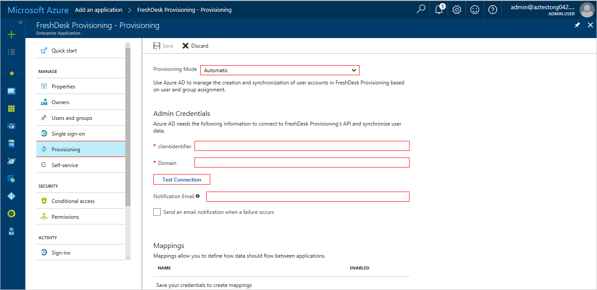

---

title: 'Tutorial: Configuring FreshDesk for automatic user provisioning with Azure Active Directory | Microsoft Docs'
description: Learn how to configure Azure Active Directory to automatically provision and de-provision user accounts to FreshDesk.
services: active-directory
documentationcenter: ''
author: asmalser-msft
writer: asmalser-msft
manager: sakula

ms.assetid: aa5f8b72-b80c-40c0-8fb3-a2ba56fea52b
ms.service: active-directory
ms.workload: identity
ms.tgt_pltfrm: na
ms.devlang: na
ms.topic: article
ms.date: 10/19/2017
ms.author: asmalser-msft
ms.reviewer: asmalser

---

# Tutorial: Configuring FreshDesk for Automatic User Provisioning

The objective of this tutorial is to show you the steps you need to perform in FreshDesk and Azure AD to automatically provision and de-provision user accounts & groups from Azure AD to FreshDesk.

## Prerequisites

The scenario outlined in this tutorial assumes that you already have the following items:

*   An Azure Active Active directory tenant
*   A FreshDesk tenant with the [BLOSSOM plan](https://freshdesk.com/pricing) or better enabled 
*   A user account in FreshDesk with Admin permissions 

Note: The Azure AD provisioning integration relies on the [FreshDesk Rest V2 API](https://developers.freshdesk.com/api/) which is available to FreshDesk.

## Assigning users to FreshDesk

Azure Active Directory uses a concept called "assignments" to determine which users should receive access to selected apps. In the context of automatic user account provisioning, only the users and groups that have been "assigned" to an application in Azure AD will be synchronized. 

Before configuring and enabling the provisioning service, you will need to decide what users and/or groups in Azure AD represent the users who need access to your FreshDesk app. Once decided, you can assign these users to your FreshDesk app by following the instructions here:

[Assign a user or group to an enterprise app](active-directory-coreapps-assign-user-azure-portal.md)

### Important tips for assigning users to FreshDesk

*	It is recommended that a single Azure AD user be assigned to FreshDesk to test the provisioning configuration. Additional users and/or groups may be assigned later.

*	When assigning a user to FreshDesk, you must select the **User** or **Group** role in the assignment dialog. The "Default Access" role does not work for provisioning.

> [!NOTE] 
> As an added feature, the provisioning service supports default roles defined in Citrix ShareFile, they can be selected in the **Select Role** dialog. These roles will be visible in the Azure portal after the provisioning service is enabled.

## Configuring user provisioning to FreshDesk 

This section guides you through connecting your Azure AD to FreshDesk user account provisioning API, and configuring the provisioning service to create, update and disable assigned user accounts in FreshDesk based on user and group assignment in Azure AD.

> [!TIP]
> You may also choose to enabled SAML-based Single Sign-On for FreshDesk, following the instructions provided in [Azure portal](https://portal.azure.com). Single sign-on can be configured independently of automatic provisioning, though these two features compliment each other.

### To configure automatic user account provisioning to FreshDesk in Azure AD:

1)	In the [Azure portal](https://portal.azure.com), browse to the **Azure Active Directory > Enterprise Apps > All applications**  section.

2) If you have already configured FreshDesk for single sign-on, search for your instance of FreshDesk using the search field. Otherwise, select **Add** and search for **FreshDesk** in the application gallery. Select **FreshDesk** from the search results, and add it to your list of applications.

3)	Select your instance of FreshDesk, then select the **Provisioning** tab.

4)	Set the **Provisioning Mode** to **Automatic**.

    
    
5) Under the Admin Credentials section, perform the following steps:
   
    a. In the **FreshDesk Client Identifier** textbox, enter the FreshDesk API key.

        > **Tip** [How to find your API key](https://support.freshdesk.com/support/solutions/articles/215517-how-to-find-your-api-key)
    
    b. In the **FreshDesk Domain** textbox, enter the FreshDesk tenant name like contoso.freshdesk.com

6) In the Azure portal, click **Test Connection** to ensure Azure AD can connect to your FreshDesk app. If the connection fails, ensure your FreshDesk account has Admin permissions and try the **"Test Connection"** step again.

7) Enter the email address of a person or group who should receive provisioning error notifications in the **Notification Email** field, and check the checkbox below.

8) Click **Save**. 

9) Under the Mappings section, select **Synchronize Azure Active Directory Users to FreshDesk**.

10) In the **Attribute Mappings** section, review the user attributes that will be synchronized from Azure AD to FreshDesk. Note that the attributes selected as **Matching** properties will be used to match the user accounts in FreshDesk for update operations. Select the **Save** button to commit any changes. See [Customizing User Provisioning Attribute Mappings](active-directory-saas-customizing-attribute-mappings.md) for more details

11) To enable the Azure AD provisioning service for FreshDesk, change the **Provisioning Status** to **On** in the **Settings** section

12) Click **Save**. 

This starts the initial synchronization of any users and/or groups assigned to FreshDesk in the Users and Groups section. The initial takes longer to perform than subsequent syncs, which occur approximately every 20 minutes as long as the service is running. You can use the **Synchronization Details** section to monitor progress and follow links to provisioning activity reports, which describe all actions performed by the provisioning service on your FreshDesk app.

## Configuring group object provisioning to FreshDesk 

Provisioning of group objects from Azure AD to FreshDesk. This is different from "assigning groups of users", in that the actual group object in addition to its members will be replicated from Azure AD to FreshDesk. For example, if you have a group named "My Group" in Azure AD, an identitical group named "My Group" will be created inside FreshDesk.

### Attribute Mappings of group objects:

1) In the **Attribute Mappings** section, review the group attributes that will be synchronized from Azure AD to FreshDesk. Note that the attributes selected as **Matching** properties will be used to match the groups in FreshDesk for update operations. 

2) Click **Save**.

This result in any group objects assigned to FreshDesk in the **Users and Groups** section being fully synchronized from Azure AD to FreshDesk. You can use the **Synchronization Details** section to monitor progress and follow links to provisioning activity reports, which describe all actions performed by the provisioning service on your FreshDesk app.

For more information on how to read the Azure AD provisioning logs, see [Reporting on automatic user account provisioning](https://docs.microsoft.com/en-us/azure/active-directory/active-directory-saas-provisioning-reporting).

## Additional Resources

* [Managing user account provisioning for Enterprise Apps](active-directory-enterprise-apps-manage-provisioning.md)
* [What is application access and single sign-on with Azure Active Directory?](active-directory-appssoaccess-whatis.md)
* [Configure Single Sign-on](active-directory-saas-freshdesk-tutorial.md)