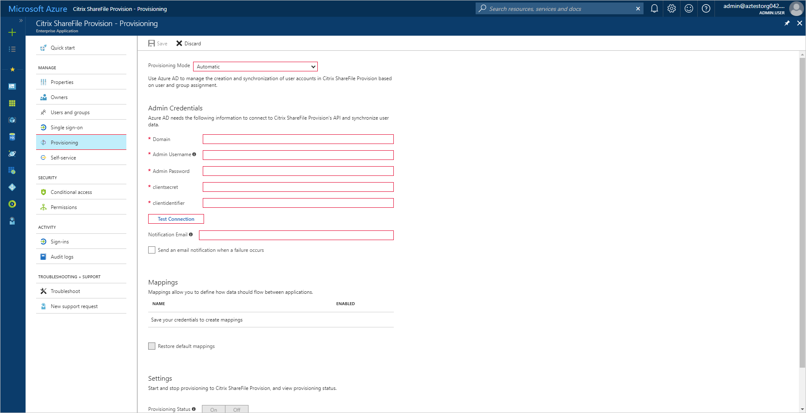

---
title: 'Tutorial: Configuring Citrix ShareFile for automatic user provisioning with Azure Active Directory | Microsoft Docs'
description: Learn how to configure Azure Active Directory to automatically provision and de-provision user accounts to Citrix ShareFile.
services: active-directory
documentationcenter: ''
author: asmalser-msft
writer: asmalser-msft
manager: sakula

ms.assetid: 4fc80aba-e27e-49e5-a481-5ee3e8cd806d
ms.service: active-directory
ms.workload: identity
ms.tgt_pltfrm: na
ms.devlang: na
ms.topic: article
ms.date: 10/18/2017
ms.author: asmalser-msft
ms.reviewer: asmalser

---

# Tutorial: Configuring Citrix ShareFile for Automatic User Provisioning

The objective of this tutorial is to show you the steps you need to perform in Citrix ShareFile and Azure AD to automatically provision and de-provision user accounts & groups from Azure AD to Citrix ShareFile.

## Prerequisites

The scenario outlined in this tutorial assumes that you already have the following items:

*   An Azure Active Active directory tenant
*   A Citrix ShareFile tenant with the [Business plan](https://www.sharefile.com/pricing) or better enabled 
*   A user account in ShareFile with superuser permissions 

Note: The Azure AD provisioning integration relies on the [Citrix ShareFile Rest V3 API](https://api.sharefile.com/rest/docs/resource.aspx?name=Items) which is available to Citrix ShareFile on the Business plan or better.

## Assigning users to Citrix ShareFile

Azure Active Directory uses a concept called "assignments" to determine which users should receive access to selected apps. In the context of automatic user account provisioning, only the users and groups that have been "assigned" to an application in Azure AD will be synchronized. 

Before configuring and enabling the provisioning service, you will need to decide what users and/or groups in Azure AD represent the users who need access to your Citrix ShareFile app. Once decided, you can assign these users to your Citrix ShareFile app by following the instructions here:

[Assign a user or group to an enterprise app](active-directory-coreapps-assign-user-azure-portal.md)

### Important tips for assigning users to Citrix ShareFile

*	It is recommended that a single Azure AD user be assigned to Citrix ShareFile to test the provisioning configuration. Additional users and/or groups may be assigned later.

*	When assigning a user to Citrix ShareFile, you must select the **User** or **Group** role in the assignment dialog. The "Default Access" role does not work for provisioning.

## Configuring user provisioning to Citirx ShareFile 

This section guides you through connecting your Azure AD to Citrix ShareFile user account provisioning API, and configuring the provisioning service to create, update and disable assigned user accounts in Citrix ShareFile based on user and group assignment in Azure AD.

> [!TIP]
> You may also choose to enabled SAML-based Single Sign-On for Citrix GoToMeeting, following the instructions provided in [Azure portal](https://portal.azure.com). Single sign-on can be configured independently of automatic provisioning, though these two features compliment each other.

### To configure automatic user account provisioning to Citrix ShareFile in Azure AD:

1)	In the [Azure portal](https://portal.azure.com), browse to the **Azure Active Directory > Enterprise Apps > All applications**  section.

2) If you have already configured Citrix ShareFile for single sign-on, search for your instance of Citrix ShareFile using the search field. Otherwise, select **Add** and search for **Citrix** in the application gallery. Select **Citrix ShareFile** from the search results, and add it to your list of applications.

3)	Select your instance of **Citrix ShareFile**, then select the **Provisioning** tab.

4)	Set the **Provisioning Mode** to **Automatic**.

    
    
5. Under the Admin Credentials section, perform the following steps:
   
    a. In the **Citrix ShareFile Domain** textbox, enter the Citrix ShareFile tenant name like contoso.

    b. In the **Citrix ShareFile Admin User Name** textbox, type the user name of a superuser.

    c. In the **Citrix ShareFile Admin Password** textbox, the superuser password.
    
    d. In the **Citrix ShareFile Client Secret** textbox, enter the Citrix ShareFile tenant Client Secret.
    
    e. In the **Citrix ShareFile Client Identifier** textbox, enter the Citrix ShareFile tenant Client Identifer.
    
         For generating client secret & client Identifier goto [https://api.sharefile.com](https://api.sharefile.com) and login using your superuser credentials and click on Get API Keys).
         
        
	
6) In the Azure portal, click **Test Connection** to ensure Azure AD can connect to your Citrix ShareFile app. If the connection fails, ensure your Citrix ShareFile account has superuser permissions and try the **"Test Connection"** step again.

7) Enter the email address of a person or group who should receive provisioning error notifications in the **Notification Email** field, and check the checkbox below.

8) Click **Save**. 

9) Under the Mappings section, select **Synchronize Azure Active Directory Users to Citrix ShareFile**.

10) In the **Attribute Mappings** section, review the user attributes that will be synchronized from Azure AD to Citrix ShareFile. Note that the attributes selected as **Matching** properties will be used to match the user accounts in Citrix ShareFile for update operations. Select the Save button to commit any changes.

11) To enable the Azure AD provisioning service for Citrix ShareFile, change the **Provisioning Status** to **On** in the **Settings** section

12) Click **Save**. 

This starts the initial synchronization of any users and/or groups assigned to Citrix ShareFile in the Users and Groups section. The initial takes longer to perform than subsequent syncs, which occur approximately every 20 minutes as long as the service is running. You can use the **Synchronization Details** section to monitor progress and follow links to provisioning activity reports, which describe all actions performed by the provisioning service on your Citrix ShareFile app.

## [Optional] Configuring group object provisioning to Citrix ShareFile 

Optionally, you can enable the provisioning of group objects from Azure AD to Citrix ShareFile. This is different from "assigning groups of users", in that the actual group object in addition to its members will be replicated from Azure AD to Citrix ShareFile. For example, if you have a group named "My Group" in Azure AD, an identitical group named "My Group" will be created inside Citrix ShareFile.

### To enable provisioning of group objects:

1) Under the Mappings section, select **Synchronize Azure Active Directory Groups to Citrix ShareFile**.

2) In the Attribute Mapping blade, set **Enabled to Yes**.

3) In the **Attribute Mappings** section, review the group attributes that will be synchronized from Azure AD to Citrix ShareFile. Note that the attributes selected as **Matching** properties will be used to match the groups in Citrix ShareFile for update operations. 

4) Click **Save**.

This result in any group objects assigned to Citrix ShareFile in the **Users and Groups** section being fully synchronized from Azure AD to Citrix ShareFile. You can use the **Synchronization Details** section to monitor progress and follow links to provisioning activity reports, which describe all actions performed by the provisioning service on your Citrix ShareFile app.

For more information on how to read the Azure AD provisioning logs, see [Reporting on automatic user account provisioning](https://docs.microsoft.com/en-us/azure/active-directory/active-directory-saas-provisioning-reporting).

## Additional Resources

* [Managing user account provisioning for Enterprise Apps](active-directory-enterprise-apps-manage-provisioning.md)
* [What is application access and single sign-on with Azure Active Directory?](active-directory-appssoaccess-whatis.md)
* [Configure Single Sign-on](active-directory-saas-sharefile-tutorial.md)